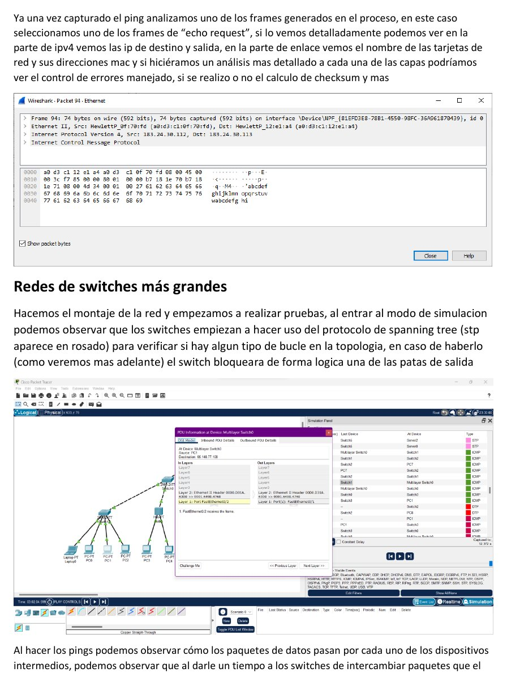
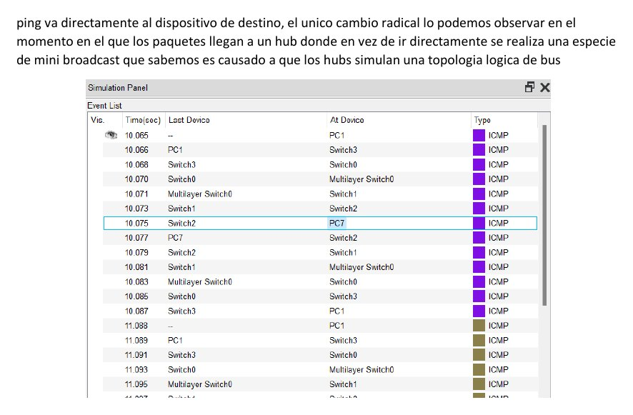
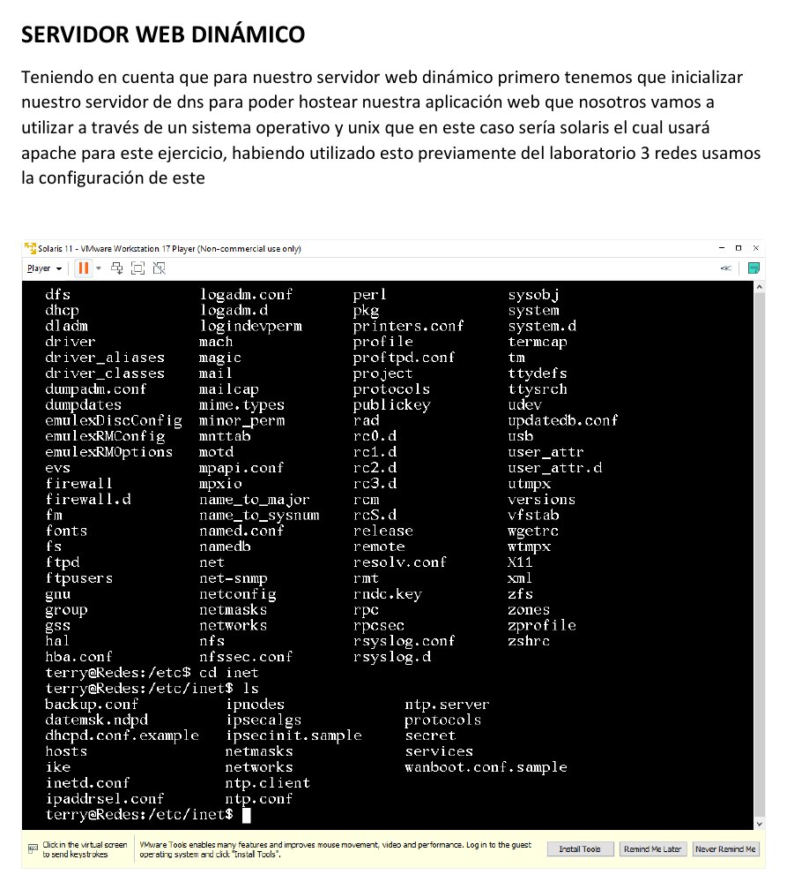

# Laboratorio 8 - Switching, VLAN, Ethernet y WiFi

**Autores:** Juan Esteban Ortiz Pastrana y Santiago Alberto Naranjo Abril  
**Institución:** Escuela Colombiana de Ingeniería Julio Garavito  
**Grupo:** 2  
**Fecha:** 9 de diciembre de 2023

## Objetivo

Comprender redes Ethernet y WiFi, configurar switches, segmentar mediante VLAN y desplegar un servicio web dinámico sobre Solaris.

## Fundamentos

### Switches

- **Capa 2:** opera con direcciones MAC, conecta dispositivos dentro de una LAN y permite asignar VLAN a los puertos.
- **Capa 3:** incorpora direccionamiento lógico y enrutamiento entre subredes.

### Tecnologías relacionadas

- **Ethernet:** define la transmisión sobre redes cableadas.
- **WiFi:** conecta dispositivos mediante radiofrecuencia.
- **VLAN:** segmenta lógicamente una red física para reducir tráfico y aplicar políticas.
- **CLI:** permite configurar dispositivos mediante comandos de texto.

## Configuración básica y análisis

Se conectaron dos equipos a un switch y se verificó la comunicación mediante `ping`. Wireshark permitió observar una solicitud ICMP y revisar direcciones IP y MAC, encapsulamiento, errores y checksum.

## Redes de switches

En una topología mayor se observó el funcionamiento de STP. El protocolo detecta bucles y bloquea lógicamente uno de los enlaces redundantes. También se comparó el reenvío dirigido de los switches con el comportamiento de difusión de un hub.

## VLAN

Se crearon VLAN, se asignaron puertos y se probó la comunicación entre dispositivos pertenecientes al mismo segmento lógico. Wireshark permitió identificar la VLAN asociada al tráfico capturado.

## WiFi

El router se administró desde `192.168.0.1`. La configuración incluyó:

- Nombre de red.
- Contraseña.
- Dirección IP y máscara.
- Rango de asignación DHCP.
- Canal e intensidad de señal.
- Ocultamiento del SSID.

Se conectaron teléfonos y se realizaron pruebas de `ping` y acceso a Internet.

## Servidor web dinámico

Se reutilizó la infraestructura DNS del laboratorio 3. Sobre Solaris se configuró Apache y se trasladó mediante Samba una calculadora de notas desarrollada en PHP. La aplicación quedó accesible en la dirección `10.2.67.112`.

## Conclusiones

Los switches son componentes esenciales para un flujo de datos eficiente. La capa 2 resuelve comunicación local mediante MAC y VLAN; la capa 3 agrega direccionamiento lógico, control de subredes y enrutamiento. La práctica también muestra cómo Ethernet, WiFi, STP y servicios web pueden integrarse dentro de una misma infraestructura.

## Informe y archivos

- [Informe completo en PDF](laboratorio-08-switching-vlan-y-wifi.pdf)
- `Lab 8.docx`
- Topologías LAN, WiFi y red de switches de Santiago Naranjo
